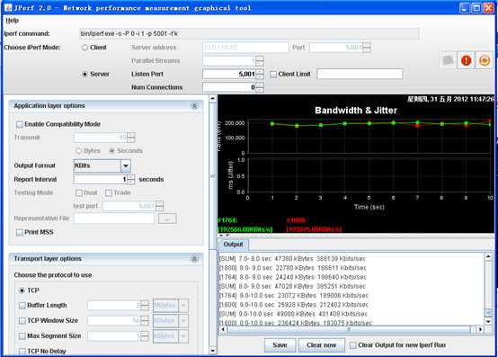
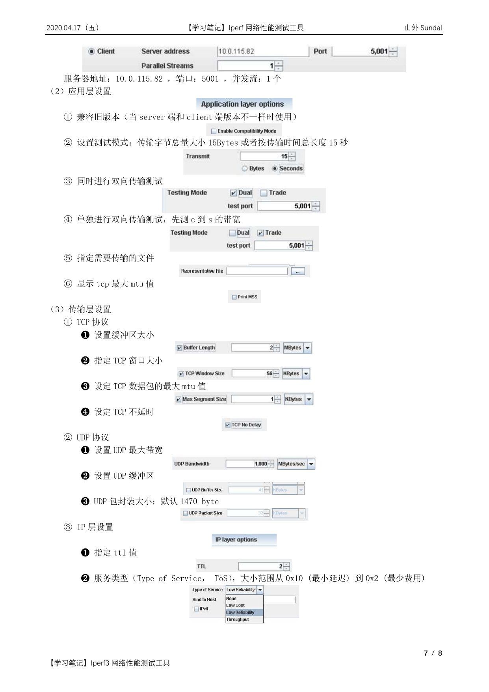

# Iperf3 网络性能测试工具


网络性能评估主要是监测网络带宽的使用率，将网络带宽利用最大化是保证网络性能的基础。但由于网络设计不合理、网络存在安全漏洞等原因，都会导致网络带宽利用率不高。要找到网络带宽利用率不高的原因，就需要对网络传输进行监控，此时就需要用到一些网络性能评估工具，而 Iperf 就是这样一款网络带宽测试工具。

## Iperf 简介

### 什么是 iperf？

Iperf 是美国伊利诺斯大学（University of Illinois）开发的一种开源的网络性能测试工具，可以用来测试网络节点间（也包括回环）TCP 或 UDP 连接的性能，包括带宽、抖动以及丢包率。其中抖动和丢包率适用于 UDP 测试，而带宽测试适用于 TCP 和 UDP。

Iperf 是一款基于 TCP/IP 和 UDP/IP 的网络性能测试工具，可以用来测量网络带宽和网络质量，提供网络延迟抖动、数据包丢失率、最大传输单元等统计信息。网络管理员可以根据这些信息了解并判断网络性能问题，从而定位网络瓶颈，解决网络故障。

Iperf 是一款基于命令行模式的网络性能测试工具，是跨平台的，提供横跨 Windows、Linux、Mac 的全平台支持。iperf 全程使用内存作为发送/接收缓冲区，不受磁盘性能的影响，对于机器配置要求很低。不过由于是命令行工具，iperf 不支持输出测试图形。

Iperf 可以测试 TCP 和 UDP 带宽质量，具有多种参数和 UDP 特性，可以用来测试一些网络设备如路由器、防火墙、交换机等的性能。

### Iperf 的功能

**（1）TCP 方面**

- 测量网络带宽
- 报告 MSS/MTU 值的大小和观测值
- 支持 TCP 窗口值通过套接字缓冲
- 当 P 线程或 Win32 线程可用时，支持多线程。客户端与服务端支持同时多重连接

**（2）UDP 方面**

- 客户端可以创建指定带宽的 UDP 流
- 测量丢包
- 测量延迟
- 支持多播
- 当 P 线程可用时，支持多线程。客户端与服务端支持同时多重连接（不支持 Windows）

**（3）其他方面**

- 在适当的地方，选项中可以使用 K（kilo-）和 M（mega-）。例如 131072 字节可以用 128K 代替
- 可以指定运行的总时间，甚至可以设置传输的数据总量
- 在报告中，为数据选用最合适的单位
- 服务器支持多重连接，而不是等待一个单线程测试
- 在指定时间间隔重复显示网络带宽、波动和丢包情况
- 服务器端可作为后台程序运行
- 服务器端可作为 Windows 服务运行
- 使用典型数据流来测试链接层压缩对于可用带宽的影响

## Iperf 的安装

### iperf 的版本

Iperf 有两种版本，Windows 版和 Linux 版本。

**（1）Unix/Linux 版**

更新比较快，版本最新，目前最新的版本是 iperf3.0。

Linux 版本下载地址：<http://code.google.com/p/iperf/downloads/list>

为了测试的准确性，尽量使用 Linux 环境测试。

**（2）Windows 版**

Windows 版 iperf 叫 jperf，或者 xjperf，更新慢，目前最新版本为 1.7（打包在 jperf 中）。

Windows 版本下载地址：<http://sourceforge.net/projects/iperf/files/jperf/jperf%202.0.0/>

jperf 是在 iperf 基础上开发的图形界面程序，简化了复杂命令行参数的构造，而且还能保存测试结果，同时实时图形化显示结果。

### Windows 版 iperf 安装

对于 Windows 版的 iperf，下载安装包后直接解压，然后将解压出来的 `iperf.exe` 和 `cygwin1.dll` 复制到 `%systemroot%` 目录即可。

### Linux 版 iperf 安装

**（1）在线安装**

```bash
# CentOS
yum install -y iperf3

# Debian / Ubuntu
apt-get install iperf3
```

**（2）离线安装**

```bash
gunzip -c iperf-<version>.tar.gz | tar -xvf -
cd iperf-<version>
./configure
make
make install
```

## Iperf 的使用

### Iperf 的工作模式

Iperf 可以运行在任何 IP 网络上，包括本地以太网、接入因特网、Wi-Fi 网络等。在工作模式上，iperf 运行于服务器、客户端模式下，其服务器端主要用于监听到达的测试请求，而客户端主要用于发起测试连接会话，因此要使用 iperf 至少需要两台服务器，一台运行在服务器模式下，另一台运行在客户端模式下。

在完成 iperf 安装后，执行 `iperf3 -h` 即可显示 iperf 的详细用法。iperf 的命令行选项共分为三类，分别是客户端与服务器端公用选项、服务器端专用选项和客户端专用选项。

### Iperf 常用参数（测试够用）

| 参数 | 说明 |
|------|------|
| `-s, --server` | iperf 服务器模式，默认启动的监听端口为 5201，如：`iperf -s` |
| `-c, --client host` | iperf 客户端模式，host 是 server 端地址，如：`iperf -c 222.35.11.23` |
| `-i, --interval` | 指定每次报告之间的时间间隔，单位为秒，如：`iperf3 -c 192.168.12.168 -i 2` |
| `-p, --port` | 指定服务器端监听的端口或客户端所连接的端口，默认是 5001 端口 |
| `-u, --udp` | 表示采用 UDP 协议发送报文，不带该参数表示采用 TCP 协议 |
| `-l, --len` | 设置读写缓冲区的长度，单位为 Byte。TCP 方式默认为 8KB，UDP 方式默认为 1470 字节。通常测试 PPS 的时候该值为 16，测试 BPS 时该值为 1400 |
| `-b, --bandwidth [K\|M\|G]` | 指定 UDP 模式使用的带宽，单位 bits/sec，默认值是 1 Mbit/sec |
| `-t, --time` | 指定数据传输的总时间，即在指定的时间内，重复发送指定长度的数据包。默认 10 秒 |
| `-A` | CPU 亲和性，可以将具体的 iperf3 进程绑定对应编号的逻辑 CPU，避免 iperf 进程在不同的 CPU 间调度 |

### 通用参数（Server 端和 Client 端共用）

| 参数 | 说明 |
|------|------|
| `-f, --format [k\|m\|g\|K\|M\|G]` | 指定带宽输出单位，`[k\|m\|g\|K\|M\|G]` 分别表示以 Kbits、Mbits、Gbits、KBytes、MBytes、GBytes 显示输出结果，默认 Mbits，如：`iperf3 -c 192.168.12.168 -f M` |
| `-p, --port` | 指定服务器端监听的端口或客户端所连接的端口，默认是 5001 端口 |
| `-i, --interval` | 指定每次报告之间的时间间隔，单位为秒，如：`iperf3 -c 192.168.12.168 -i 2` |
| `-F` | 指定文件作为数据流进行带宽测试，如：`iperf3 -c 192.168.12.168 -F web-ixdba.tar.gz` |

### Server 端专用参数

| 参数 | 说明 |
|------|------|
| `-s, --server` | iperf 服务器模式，默认启动的监听端口为 5201，如：`iperf -s` |
| `-c, --client host` | 如果 iperf 运行在服务器模式，并且用 `-c` 参数指定一个主机，那么 iperf 将只接受指定主机的连接。此参数不能工作于 UDP 模式 |
| `-D` | Unix 平台下将 Iperf 作为后台守护进程运行。在 Win32 平台下，Iperf 将作为服务运行 |
| `-R` | 卸载 Iperf 服务（仅用于 Windows） |
| `-o` | 重定向输出到指定文件（仅用于 Windows） |
| `-P, --parallel` | 服务器关闭之前保持的连接数。默认是 0，这意味着永远接受连接 |

### Client 端专用参数

| 参数 | 说明 |
|------|------|
| `-c, --client host` | iperf 客户端模式，host 是 server 端地址，如：`iperf -c 222.35.11.23` |
| `-u, --udp` | 表示采用 UDP 协议发送报文，不带该参数表示采用 TCP 协议 |
| `-b, --bandwidth [K\|M\|G]` | 指定 UDP 模式使用的带宽，单位 bits/sec，默认值是 1 Mbit/sec |
| `-t, --time` | 指定数据传输的总时间，即在指定的时间内，重复发送指定长度的数据包。默认 10 秒 |
| `-l, --len` | 设置读写缓冲区的长度，单位为 Byte。TCP 默认为 8KB，UDP 默认为 1470 字节。通常测试 PPS 的时候该值为 16，测试 BPS 时该值为 1400 |
| `-n, --num [K\|M\|G]` | 指定传输数据包的字节数，如：`iperf3 -c 192.168.12.168 -n 100M` |
| `-P, --parallel` | 指定客户端与服务端之间使用的线程数。默认是 1 个线程。需要客户端与服务器端同时使用此参数 |
| `-w, --window` | 指定套接字缓冲区大小，在 TCP 方式下，此设置为 TCP 窗口的大小。在 UDP 方式下，此设置为接受 UDP 数据包的缓冲区大小，用来限制可以接收数据包的最大值 |
| `-B, --bind` | 用来绑定一个主机地址或接口，这个参数仅用于具有多个网络接口的主机。在 UDP 模式下，此参数用于绑定和加入一个多播组 |
| `-M, --mss` | 设置 TCP 最大信息段的值 |
| `-N, --nodelay` | 设置 TCP 无延时 |
| `-V` | 绑定一个 IPv6 地址 |
| `-d, --dualtest` | 运行双测试模式。将使服务器端反向连接到客户端，使用 `-L` 参数中指定的端口（或默认使用客户端连接到服务器端的端口）。使用参数 `-r` 以运行交互模式 |
| `-L, --listenport` | 指定服务端反向连接到客户端时使用的端口。默认使用客户端连接至服务端的端口 |
| `-r, --tradeoff` | 往复测试模式。当客户端到服务器端的测试结束时，服务器端反向连接至客户端。当客户端连接终止时，反向连接随即开始。如果需要同时进行双向测试，请尝试 `-d` 参数 |

### 其他参数

| 参数 | 说明 |
|------|------|
| `-h, --help` | 显示命令行参考并退出 |
| `-v, --version` | 显示版本信息和编译信息并退出 |

```bash
iperf3 -h
# Usage: iperf3 [-s|-c host] [options]
#        iperf3 [-h|--help] [-v|--version]
```

## Iperf 使用实例

### 环境准备

- Server 端 IP 地址：192.168.0.120
- Client 端 IP 地址：192.168.0.121

### 测试 TCP 吞吐量

**（1）Server 端开启 iperf 的服务器模式，指定 TCP 端口**

```bash
[root@iperf-server ~]# iperf3 -s -i 1 -p 520
------------------------------------------------------------
Server listening on TCP port 520
TCP window size: 85.3 KByte (default)
------------------------------------------------------------
```

**（2）Client 端启动 iperf 的客户端模式，连接服务端**

```bash
[root@iperf-client ~]# iperf -c 192.168.0.120 -i 1 -t 60 -p 520
------------------------------------------------------------
Client connecting to 192.168.0.120, TCP port 520
TCP window size: 45.0 KByte (default)
------------------------------------------------------------
[  3] local 192.168.0.121 port 50616 connected with 192.168.0.120 port 520
[ ID] Interval       Transfer     Bandwidth
[  3]  0.0-10.1 sec  1.27 GBytes  1.08 Gbits/sec
```

**（3）Server 端监听结果**

```text
------------------------------------------------------------
Server listening on TCP port 5001
TCP window size: 85.3 KByte (default)
------------------------------------------------------------
[  4] local 192.168.0.120 port 520 connected with 192.168.0.121 port 50616
[ ID] Interval       Transfer     Bandwidth
[  4]  0.0-10.1 sec  1.27 GBytes  1.08 Gbits/sec
```

输出字段说明：

- **Interval**：时间间隔
- **Transfer**：时间间隔里面传输的数据量
- **Bandwidth**：时间间隔里的传输速率

**（4）测试多线程 TCP 吞吐量**

如果没有指定发送方式，iPerf 客户端只会使用单线程。

```bash
iperf3 -c 192.168.0.120 -P 30 -t 60
```

**（5）进行上下行带宽测试（双向传输）**

```bash
iperf3 -c 192.168.0.120 -d -t 60
```

**（6）其他建议**

- 建议在 Server 端执行 `sar` 命令来统计实际收到的包并作为实际结果：`sar -n DEV 1 320`
- 要停止 iperf3 服务进程，请按 `Ctrl+Z` 或 `Ctrl+C`

### 测试 UDP 吞吐量

带宽测试通常采用 UDP 模式，因为能测出极限带宽、时延抖动、丢包率。在进行测试时，首先以链路理论带宽作为数据发送速率进行测试，例如，从客户端到服务器之间的链路的理论带宽为 100Mbps，先用 `-b 100M` 进行测试，然后根据测试结果（包括实际带宽、时延抖动和丢包率），再以实际带宽作为数据发送速率进行测试，会发现时延抖动和丢包率比第一次好很多，重复测试几次，就能得出稳定的实际带宽。

**（1）Server 端开启 iperf 的服务器模式，指定 UDP 端口**

```bash
[root@iperf-server ~]# iperf3 -s -i 1 -p 521
------------------------------------------------------------
Server listening on port 521
------------------------------------------------------------
```

**（2）Client 端启动 iperf 的客户端模式，连接服务端**

```bash
[root@iperf-client ~]# iperf3 -u -c 192.168.0.120 -b 100m -t 60 -p 521
------------------------------------------------------------
Client connecting to 192.168.0.120, port 521
------------------------------------------------------------
[  3] local 192.168.0.121 port 50616 connected with 192.168.0.120 port 521
[ ID] Interval       Transfer     Bandwidth       TotalDatagrams
[  3]  0.0-10.1 sec  1.27 GBytes  1.08 Gbits/sec  82
```

**（3）Server 端监听结果**

```text
------------------------------------------------------------
Server listening on port 521
------------------------------------------------------------
[  4] local 192.168.0.120 port 520 connected with 192.168.0.121 port 50616
[ ID] Interval       Transfer     Bandwidth       Jitter   Lost/Total Datagrams
[  4]  0.0-10.1 sec  1.27 GBytes  1.08 Gbits/sec  0.007 ms  0/82 (0%)
```

输出字段说明：

- **Jitter**：抖动，在连续传输中的平滑平均值差
- **Lost**：丢包数量
- **Total Datagrams**：包数量

**（4）测试多线程 UDP 吞吐量**

```bash
iperf3 -u -c 192.168.1.1 -b 5M -P 30 -t 60
```

**（5）进行上下行带宽测试（双向传输）**

```bash
iperf3 -u -c 192.168.1.1 -b 100M -d -t 60
```

## Jperf 介绍

### Jperf 简介

jperf 是基于 iperf 开发的图形界面程序，简化了复杂命令行参数的构造，而且还能够保存测试结果，同时实时图形化显示结果。JPerf 可以测试 TCP 和 UDP 带宽质量，可以测量最大 TCP 带宽，具有多种参数和 UDP 特性，可以报告带宽、延迟抖动和数据包丢失。

### JPerf2.0 运行环境

- **操作系统**：Java 运行环境
- **网络要求**：Jperf 可以在任何 IP 网络上运行，包括本地以太网、因特网接入连接和 Wi-Fi 网络
- **其他要求**：JPerf 必须安装两个组件：JPerf 服务器和 JPerf 客户端

### JPerf2.0 页面介绍





**（1）Iperf 命令行（无法直接输入）**

服务端设置：

- 监听端口：5001
- Client limit：客户端限制，仅允许指定客户端连接
- Num Connections：最大允许连接的数量，为 0 不限制

客户端设置：

- 服务器地址：10.0.115.82，端口：5001，并发流：1 个

**（2）应用层设置**

- 兼容旧版本（当 server 端和 client 端版本不一样时使用）
- 设置测试模式：传输字节总量大小 15 Bytes 或者按传输时间总长度 15 秒
- 同时进行双向传输测试
- 单独进行双向传输测试，先测 c 到 s 的带宽
- 指定需要传输的文件
- 显示 TCP 最大 MTU 值

**（3）传输层设置**

TCP 协议：

- 设置缓冲区大小
- 指定 TCP 窗口大小
- 设定 TCP 数据包的最大 MTU 值
- 设定 TCP 不延时

UDP 协议：

- 设置 UDP 最大带宽
- 设置 UDP 缓冲区
- UDP 包封装大小：默认 1470 byte

IP 层设置：

- 指定 TTL 值
- 服务类型（Type of Service，ToS），大小范围从 0x10（最小延迟）到 0x2（最少费用）

## 参考资料

1. [《网络性能测试方法》](https://help.aliyun.com/knowledge_detail/55757.html#HFXbx) — 阿里云帮助文档
2. [《iperf - 百度百科》](https://baike.baidu.com/item/iperf/11067694?fr=aladdin)
3. [《Linux 网络性能评估工具 iperf、CHARIOT 测试网络吞吐量》](https://www.cnblogs.com/klb561/p/9215952.html) — Konglingbin
4. [《Linux 命令大全 - iperf 命令》](https://man.linuxde.net/iperf)
5. [《网络性能测试工具 iPerf 功能与使用教程》](http://www.veryhuo.com/a/view/159685.html)
6. [《iPerf 图形化工具 Jperf 图文使用教程》](http://www.veryhuo.com/a/view/159704.html)
7. [《使用 iPerf 进行网络吞吐量测试》](https://www.jianshu.com/p/15f888309c72) — 放开那个电扇


---

> 作者: [Charles Y](https://github.com/devCharl/devcharl.github.io)  
> URL: https://devcharl.github.io/2020/04/17/iperf3-learning-note/  

