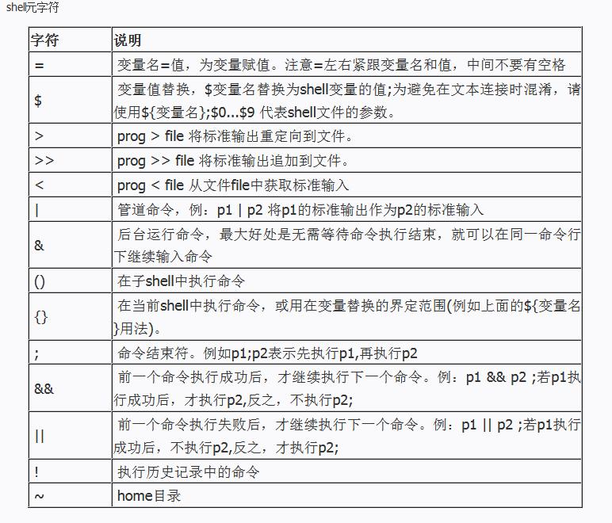
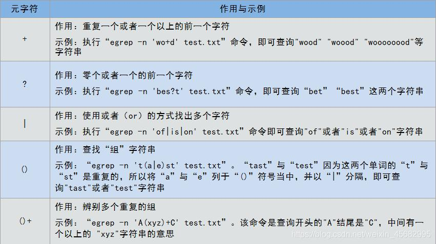

# Shell 脚本中各种符号意义详解


## 概述

Shell 中有两类字符：普通字符、元字符。

### 1. 普通字符

在 Shell 中除了本身的字面意思外没有其他特殊意义，即普通纯文本。

### 2. 元字符

是 Shell 的保留字符，在 Shell 中有着特殊的含义。




### 3. Shell 中 `$` 的用法

|名称|作用|
|:--:|:--|
|`$#`|传给脚本的参数个数|
|`$0`|脚本本身的名字|
|`$1`|传递给该shell脚本的第一个参数|
|`$2`|传递给该shell脚本的第二个参数|
|`$@`|以一个单字符串显示所有向脚本传递的参数，与位置变量不同，参数可超过9个|
|`$$`|脚本运行的当前进程ID号|
|`$?`|显示最后命令的退出状态，0表示没有错误，其他表示有错误|


### 4. 实例

```bash
#!/bin/sh
echo "参数个数:$#"
echo "脚本名字:$0"
echo "参数1:$1"
echo "参数2:$2"
echo "所有参数列表:$@"
echo "pid:$$"
if [ $1 = 100 ]
then
 echo "命令退出状态：$?" 
 exit 0 #参数正确，退出状态为0
else
 echo "命令退出状态：$?"
 exit 1 #参数错误，退出状态1
fi
```

```bash
#!/bin/bash
number=65             #定义一个退出值
index=1               #定义一个计数器
if [ -z "$1" ];then   #对用户输入的参数做判断，如果未输入参数则返回脚本的用法并退出，退出值65
   echo "Usage:$0 + 参数"
   exit $number
fi
echo "listing args with \$*:"    #在屏幕输入，在$*中遍历参数
for arg in $*                                          
do
   echo "arg: $index = $arg"                 
   let index+=1
done
echo
index=1                         #将计数器重新设置为1
echo "listing args with \"\$@\":"    #在"$@"中遍历参数
for arg in "$@"
do
   echo "arg: $index = $arg"
   let index+=1
done
```

### 5. 错误返回值

命令或脚本执行后，可通过 `$?` 查看上一条命令的退出状态：`0` 表示成功，非 `0` 通常对应系统 **errno** 错误码。常见 OS errno 如下（完整列表见 `errno` / `man errno`）。

|错误码|说明|
|:--:|:--|
|`1`|Operation not permitted|
|`2`|No such file or directory|
|`3`|No such process|
|`4`|Interrupted system call|
|`5`|Input/output error|
|`6`|No such device or address|
|`7`|Argument list too long|
|`8`|Exec format error|
|`9`|Bad file descriptor|
|`10`|No child processes|
|`11`|Resource temporarily unavailable|
|`12`|Cannot allocate memory|
|`13`|Permission denied|
|`14`|Bad address|
|`15`|Block device required|
|`16`|Device or resource busy|
|`17`|File exists|
|`18`|Invalid cross-device link|
|`19`|No such device|
|`20`|Not a directory|
|`21`|Is a directory|
|`22`|Invalid argument|
|`23`|Too many open files in system|
|`24`|Too many open files|
|`25`|Inappropriate ioctl for device|
|`26`|Text file busy|
|`27`|File too large|
|`28`|No space left on device|
|`29`|Illegal seek|
|`30`|Read-only file system|
|`31`|Too many links|
|`32`|Broken pipe|
|`33`|Numerical argument out of domain|
|`34`|Numerical result out of range|
|`35`|Resource deadlock avoided|
|`36`|File name too long|
|`37`|No locks available|
|`38`|Function not implemented|
|`39`|Directory not empty|
|`40`|Too many levels of symbolic links|
|`42`|No message of desired type|
|`43`|Identifier removed|
|`44`|Channel number out of range|
|`45`|Level 2 not synchronized|
|`46`|Level 3 halted|
|`47`|Level 3 reset|
|`48`|Link number out of range|
|`49`|Protocol driver not attached|
|`50`|No CSI structure available|
|`51`|Level 2 halted|
|`52`|Invalid exchange|
|`53`|Invalid request descriptor|
|`54`|Exchange full|
|`55`|No anode|
|`56`|Invalid request code|
|`57`|Invalid slot|
|`59`|Bad font file format|
|`60`|Device not a stream|
|`61`|No data available|
|`62`|Timer expired|
|`63`|Out of streams resources|
|`64`|Machine is not on the network|
|`65`|Package not installed|
|`66`|Object is remote|
|`67`|Link has been severed|
|`68`|Advertise error|
|`69`|Srmount error|
|`70`|Communication error on send|
|`71`|Protocol error|
|`72`|Multihop attempted|
|`73`|RFS specific error|
|`74`|Bad message|
|`75`|Value too large for defined data type|
|`76`|Name not unique on network|
|`77`|File descriptor in bad state|
|`78`|Remote address changed|
|`79`|Can not access a needed shared library|
|`80`|Accessing a corrupted shared library|
|`81`|.lib section in a.out corrupted|
|`82`|Attempting to link in too many shared libraries|
|`83`|Cannot exec a shared library directly|
|`84`|Invalid or incomplete multibyte or wide character|
|`85`|Interrupted system call should be restarted|
|`86`|Streams pipe error|
|`87`|Too many users|
|`88`|Socket operation on non-socket|
|`89`|Destination address required|
|`90`|Message too long|
|`91`|Protocol wrong type for socket|
|`92`|Protocol not available|
|`93`|Protocol not supported|
|`94`|Socket type not supported|
|`95`|Operation not supported|
|`96`|Protocol family not supported|
|`97`|Address family not supported by protocol|
|`98`|Address already in use|
|`99`|Cannot assign requested address|
|`100`|Network is down|
|`101`|Network is unreachable|
|`102`|Network dropped connection on reset|
|`103`|Software caused connection abort|
|`104`|Connection reset by peer|
|`105`|No buffer space available|
|`106`|Transport endpoint is already connected|
|`107`|Transport endpoint is not connected|
|`108`|Cannot send after transport endpoint shutdown|
|`109`|Too many references; cannot splice|
|`110`|Connection timed out|
|`111`|Connection refused|
|`112`|Host is down|
|`113`|No route to host|
|`114`|Operation already in progress|
|`115`|Operation now in progress|
|`116`|Stale NFS file handle|
|`117`|Structure needs cleaning|
|`118`|Not a XENIX named type file|
|`119`|No XENIX semaphores available|
|`120`|Is a named type file|
|`121`|Remote I/O error|
|`122`|Disk quota exceeded|
|`123`|No medium found|
|`124`|Wrong medium type|
|`125`|Operation canceled|
|`126`|Required key not available|
|`127`|Key has expired|
|`128`|Key has been revoked|
|`129`|Key was rejected by service|
|`130`|Owner died|
|`131`|State not recoverable|

以下为文中示例脚本用到的 **MySQL 错误码**（`exit` 返回值 `65` 等为自定义退出码，与 errno 不同）。

|错误码|说明|
|:--:|:--|
|`132`|Old database file|
|`133`|No record read before update|
|`134`|Record was already deleted (or record file crashed)|
|`135`|No more room in record file|
|`136`|No more room in index file|
|`137`|No more records (read after end of file)|
|`138`|Unsupported extension used for table|
|`139`|Too big row|
|`140`|Wrong create options|
|`141`|Duplicate unique key or constraint on write or update|
|`142`|Unknown character set used|
|`143`|Conflicting table definitions in sub-tables of MERGE table|
|`144`|Table is crashed and last repair failed|
|`145`|Table was marked as crashed and should be repaired|
|`146`|Lock timed out; Retry transaction|
|`147`|Lock table is full;  Restart program with a larger locktable|
|`148`|Updates are not allowed under a read only transactions|
|`149`|Lock deadlock; Retry transaction|
|`150`|Foreign key constraint is incorrectly formed|
|`151`|Cannot add a child row|
|`152`|Cannot delete a parent row|


---

> 作者: [Charles Y](https://github.com/devCharl/devcharl.github.io)  
> URL: https://devcharl.github.io/2023/02/26/shell-learning-note/  

